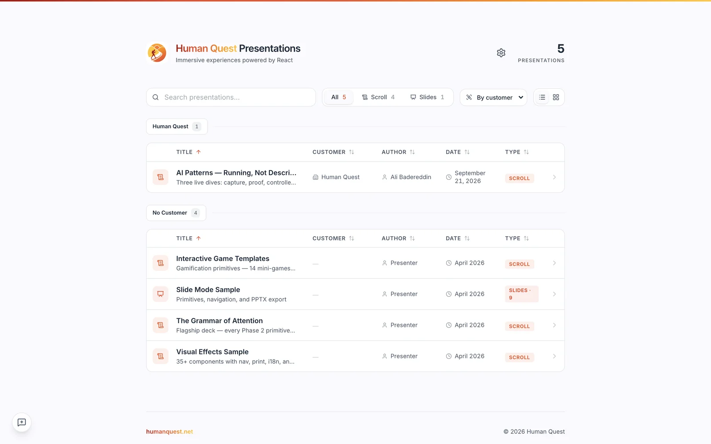
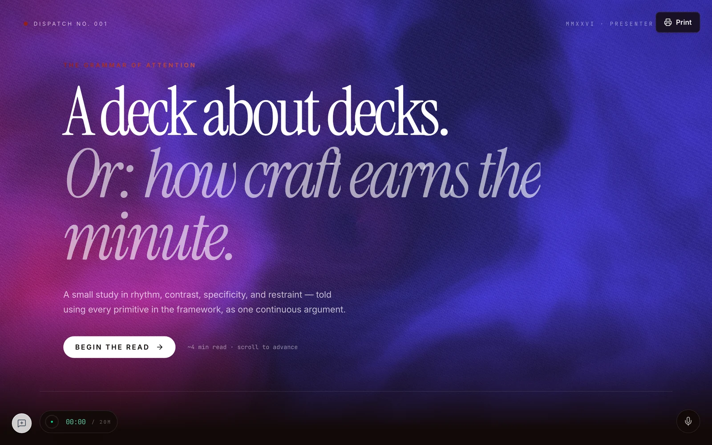
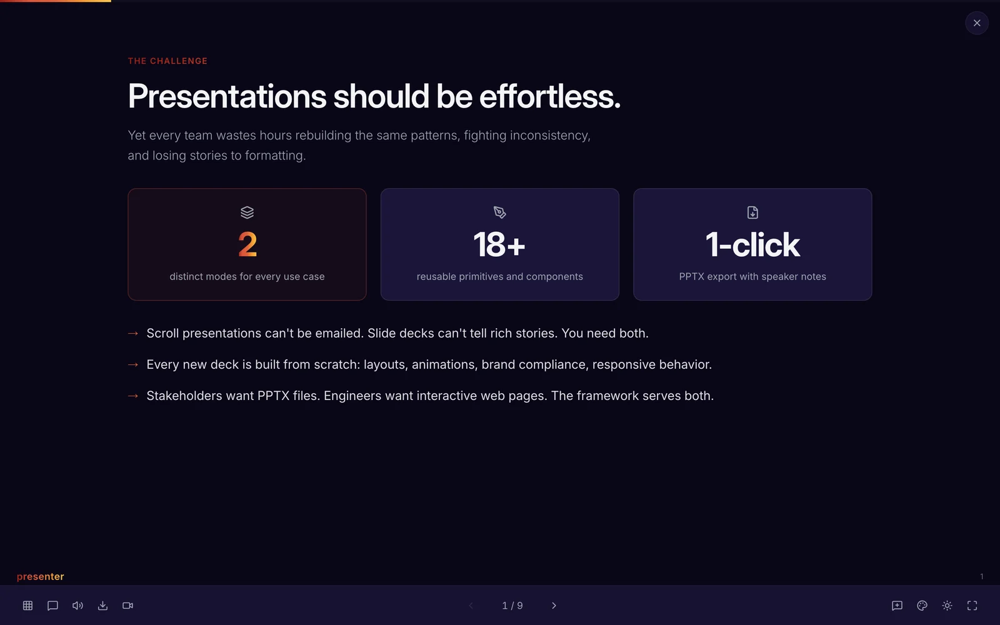

# Openstage

Openstage is a presentation system built with Next.js and React. It supports two
formats from the same codebase:

- **Scroll presentations** for interactive, long-form stories.
- **Slide decks** for fixed-canvas talks, keyboard navigation, and export.

The presentation source stays ordinary TypeScript and React. Openstage adds the
layout primitives, motion, charts, themes, speaker tools, feedback, printing,
and video rendering needed to turn that source into a finished presentation.

Live examples are available at [present.humanquest.net](https://present.humanquest.net).
The AI Patterns talk is at
[present.humanquest.net/ai-patterns](https://present.humanquest.net/ai-patterns).

## See it working

These frames were captured by Walkthrough Studio from the running product.

[](https://present.humanquest.net)

| Scroll presentation | Slide deck |
| --- | --- |
| [](https://present.humanquest.net/awwwards-flagship) | [](https://present.humanquest.net/sample-slides) |

[Watch the full authoring walkthrough](docs/media/openstage-authoring-walkthrough.mp4),
from repository brief to the finished presentation.

## Run it locally

Requirements: Node.js 20 or newer and npm.

```bash
npm install
npm run dev
```

Open [localhost:3000](http://localhost:3000). Before shipping a change, run:

```bash
npm run lint
npm run build
```

## How presentations are organized

- `src/content/` contains scroll presentations.
- `src/content/slides/` contains slide decks.
- `src/content/registry.ts` publishes presentation metadata to the gallery.
- `src/components/scrollytelling/`, `src/components/animations/`, and
  `src/components/charts/` contain the reusable visual system.
- `remotion/` renders supported presentations as video.

Start with [Creating Presentations](docs/creating-presentations.md). The sample
and flagship presentations in `src/content/` show the supported composition,
motion, chart, and export patterns.

## Configuration

Copy `.env.example` to `.env.local` only when you need an optional integration.
The example file documents each variable. Never commit `.env.local`, tokens,
private keys, or client material.

The admin and AI-assisted authoring routes need additional credentials. Reading
the public gallery and developing code-authored presentations does not.

## License

See [LICENSE](LICENSE).
